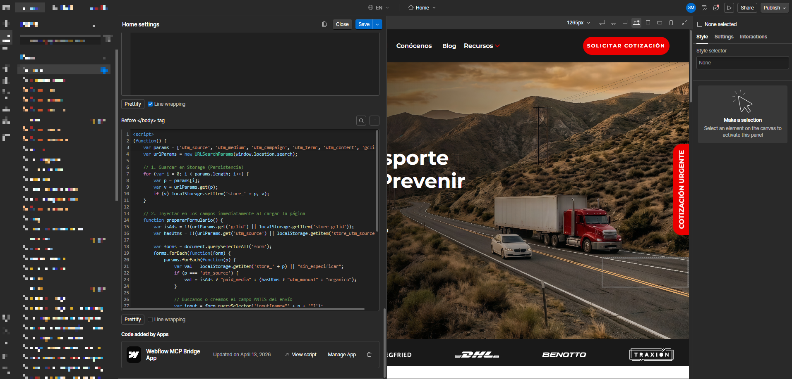
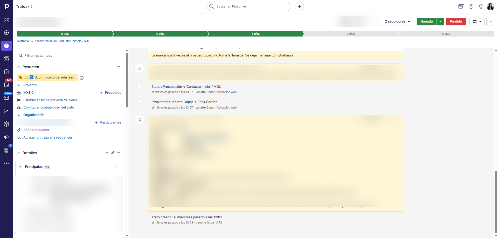
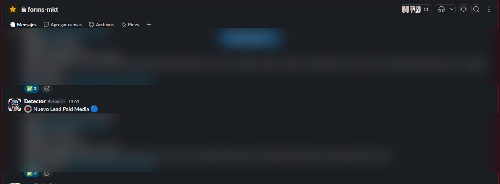

# form-to-crm-slack-notif

Automatización disparada por webhook: convierte un envío de formulario de Webflow en un lead completo dentro de Pipedrive y notifica al equipo en Slack — en tiempo real.

## Cómo funciona

```
Webflow Form Submit
       │
       ▼
POST /webhook/webflow
       │
       ├─► Pipedrive: crear Person  (nombre, email, teléfono, empresa, UTMs, GCLID, motivo de contacto)
       │                    │
       │                    └─► obtener o crear Organization
       │
       ├─► Pipedrive: crear Deal    (pipeline + stage resueltos por nombre, mensaje, utm_source)
       │
       ├─► Pipedrive: crear Note    (tabla HTML con todos los campos del formulario + parámetros de tracking)
       │
       └─► Slack: enviar notificación  (etiqueta según UTM source: paid / orgánico / manual)
```

Los IDs de pipeline y stage se resuelven por nombre al arrancar y se guardan en caché — sin overhead de búsqueda por request.

---

## Flujo completo

El script captura los UTMs en Webflow, el webhook crea el lead en Pipedrive y el equipo recibe la notificación en Slack en tiempo real.

### Script de captura de UTMs instalado en Webflow


### Lead creado en Pipedrive


### Notificación en Slack


---

## Script de captura de UTMs (Webflow)

Para que el webhook reciba `utm_source`, `utm_medium`, `utm_campaign`, `utm_term`, `utm_content` y `gclid`, el formulario de Webflow necesita inyectar esos valores como campos ocultos antes de enviarse.

El script está en [`snippets/webflow-utm-capture.js`](snippets/webflow-utm-capture.js). Cópialo dentro de una etiqueta `<script>` y pégalo en **Webflow → Page Settings → Custom Code → Before `</body>` tag** (o en el footer code del sitio si aplica a todas las páginas con formulario).

**Qué hace:**
- Lee `utm_*` y `gclid` de la URL y los guarda en `localStorage` para que persistan entre páginas (ej. landing → contacto).
- Al cargar cualquier página con formularios, crea (si no existen) campos ocultos con esos valores y los inyecta en cada `<form>`.
- Calcula `utm_source` automáticamente si no viene en la URL: `paid_media` (si hay `gclid`), `utm_manual` (si hay otros UTMs) u `organico` (si no hay ninguno) — estos son los valores que el [formato de notificación de Slack](#formato-de-notificación-de-slack) usa para etiquetar el lead.

---

## Setup

```bash
cp .env.example .env   # completa tus credenciales
npm install
npm run dev
```

El servidor queda escuchando en `http://localhost:3000` (o el puerto configurado), con el webhook en `POST /webhook/webflow`.

## Variables de entorno

| Variable | Descripción |
|---|---|
| `PORT` | Puerto del servidor (default: `3000`) |
| `PIPEDRIVE_API_TOKEN` | Token de API de Pipedrive |
| `PIPEDRIVE_PIPELINE_NAME` | Nombre del pipeline donde se crean los deals (default: `custodia`) |
| `PIPEDRIVE_STAGE_NAME` | Nombre del stage inicial del deal (default: `prospeccion`) |
| `PIPEDRIVE_GCLID_FIELD_KEY` | Key del campo personalizado para GCLID (Person) |
| `PIPEDRIVE_UTM_SOURCE_FIELD_KEY` / `..._MEDIUM_FIELD_KEY` / `..._CAMPAIGN_FIELD_KEY` / `..._TERM_FIELD_KEY` / `..._CONTENT_FIELD_KEY` | Keys de los campos personalizados de UTM (Person) |
| `PIPEDRIVE_CONTACT_REASON_FIELD_KEY` | Key del campo "Motivo de contacto" (Person) |
| `PIPEDRIVE_DUDAS_COMENTARIOS_FIELD_KEY` | Key del campo de mensaje/comentarios (Deal) |
| `PIPEDRIVE_UTM_SOURCE_DEAL_FIELD_KEY` | Key del campo utm_source (Deal) |
| `SLACK_WEBHOOK_URL` | Incoming Webhook de Slack (el canal ya está definido en la URL) |
| `DISABLE_SLACK` | `true` para omitir notificaciones de Slack (ej. en staging) |

Las keys de campos personalizados de Pipedrive se obtienen en **Settings → Data Fields**.

---

## API

### `POST /webhook/webflow`

Recibe un envío de formulario de Webflow y procesa el flujo completo del lead.

**Body esperado** (formato Webflow API v2):

```json
{
  "payload": {
    "data": {
      "name": "Jane Doe",
      "email": "jane@example.com",
      "phone": "+52 55 1234 5678",
      "company": "Acme Corp",
      "contact_reason": "Quiero más información",
      "message": "¿Tienen disponibilidad para...?",
      "utm_source": "paid_media",
      "utm_medium": "cpc",
      "utm_campaign": "brand-2024",
      "utm_term": "keyword",
      "utm_content": "ad-variant-a",
      "gclid": "Cj0KCQiA..."
    }
  }
}
```

**Respuestas:**

| Status | Significado |
|---|---|
| `200` | Lead creado — devuelve `{ dealId, personId }` |
| `400` | Falta `name`/`email` o body mal formado |
| `500` | Error de API upstream (Pipedrive o Slack) |

### `GET /health`

Devuelve `{ "status": "ok" }`. Úsalo para monitoreo de uptime.

---

## Formato de notificación de Slack

Las notificaciones se etiquetan según `utm_source`:

| utm_source | Etiqueta |
|---|---|
| `paid_media` | Nuevo Lead Paid Media 🔵 |
| `organico` | Nuevo Lead Orgánico 🟢 |
| `utm_manual` | Nuevo Lead Manual 🟡 |
| *(cualquier otro)* | Nuevo Lead ⚪ |

---

## Tech stack

- **Node.js + Express** — servidor del webhook
- **Pipedrive REST API v1** — Person, Organization, Deal, Note (vía Axios)
- **Slack Incoming Webhooks** — notificación al equipo (vía Axios)
- **dotenv** — configuración por variables de entorno
- **nodemon** — servidor de desarrollo
